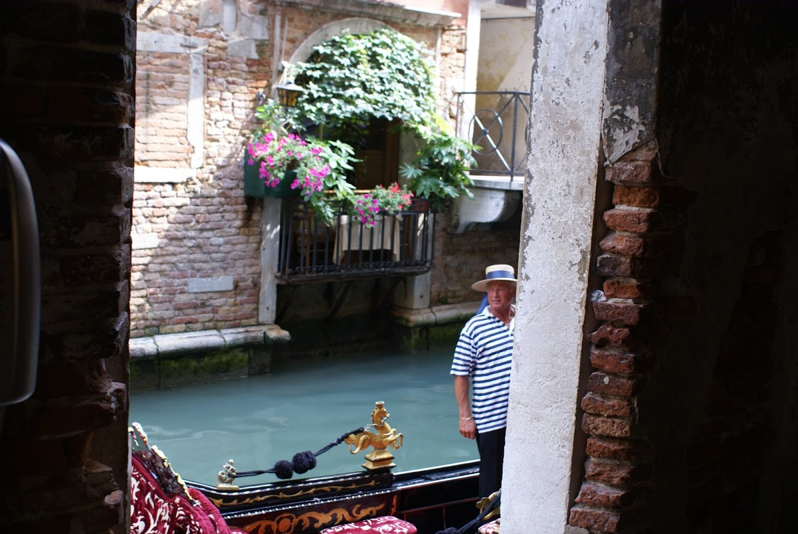
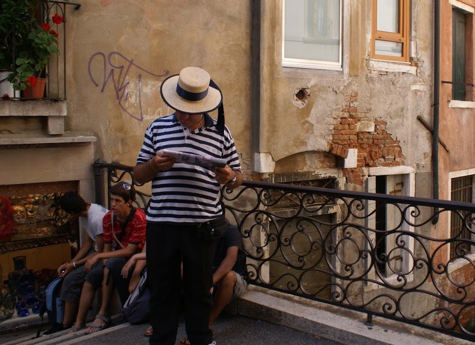
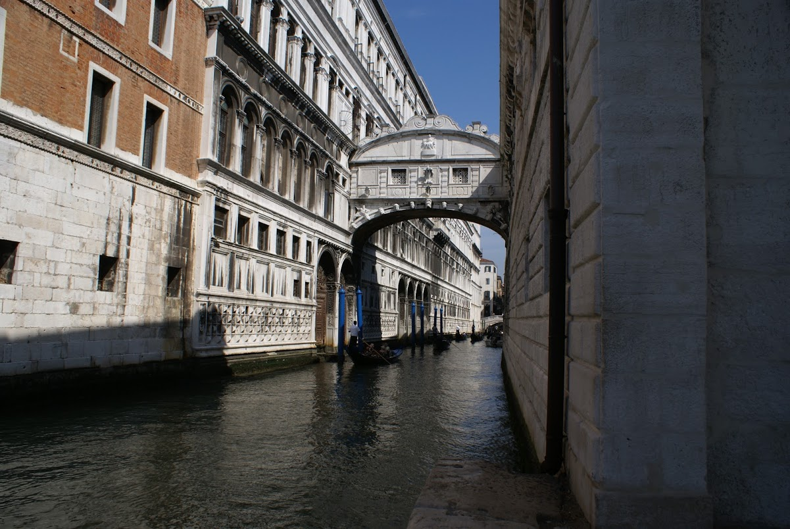
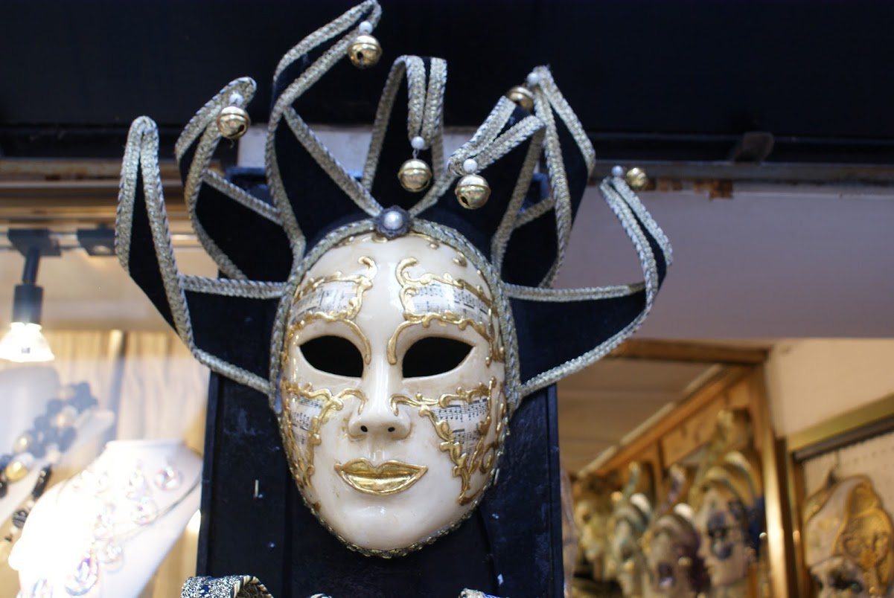
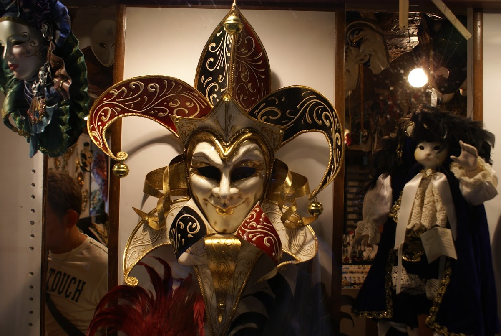

Photo dump from a family holiday to Venice in 2008.
<!--more-->

Just off St Mark's Square in Venice, there's a little 'square' where the Gondoliers await tourists to take on trips around the city. This Gondolier was just pulling in when we came across the area.

## History of The Bridge of Sighs

The bridge was actually constructed in 1600 for the purpose of connecting the Doge's Palace to the prisons across the Rio de Palazzo. The bridge was designed by Antonio Contino and is constructed of white limestone. Contino's uncle, Antonio da Ponte is best known for designing the fabulous Rialto Bridge which spans the Grand Canal. The romantic notion that prisoners would sigh taking their last look at the free world is debunked somewhat by the fact that it's very difficult to see through the stone windows of the bridge!

This is the famous **Bridge of Sighs** which can be found off the Grand Canal in Venice. It's a covered bridge which was used to transport prisoners from the Doge's Palace through to the prisons. It used to be said that the bridge derived its name from the sighs of the prisoners who would cross the bridge and experience their last view of the outside world. However, it's claimed that this name was popularised by Lord Byron, despite the fact that the cells were mostly used to detain small-time criminals.

## Venetian Carnival Masks

 

The tourist traps all around Venice are littered with little shops selling carnival masks. Apparently the tradition of holding carnivals in Venice dates back to 1268, and masks were an integral part of the celebrations. The carnivals would last so long that it was possible to spend a fair amount of the year in disguise, which would have been useful for the criminal element I'm sure... This brilliant golden mask was in the window of one such shop and has three faces blended into one. Apparently there are two methods of making masks - one with leather and the other with _papier-mâché._

In contrast to the previous mask, this one is much grander. Apparently the mask making industry in Venice was so important, it had its own guild. The status of the mask makers was so great that they apparently had their own laws. When Venice was handed over to Austria by Napoleon in 1797, the carnivals were banned and the tradition ended for 200 years, only resuming in the 1980's when a mask shop opened in the city.