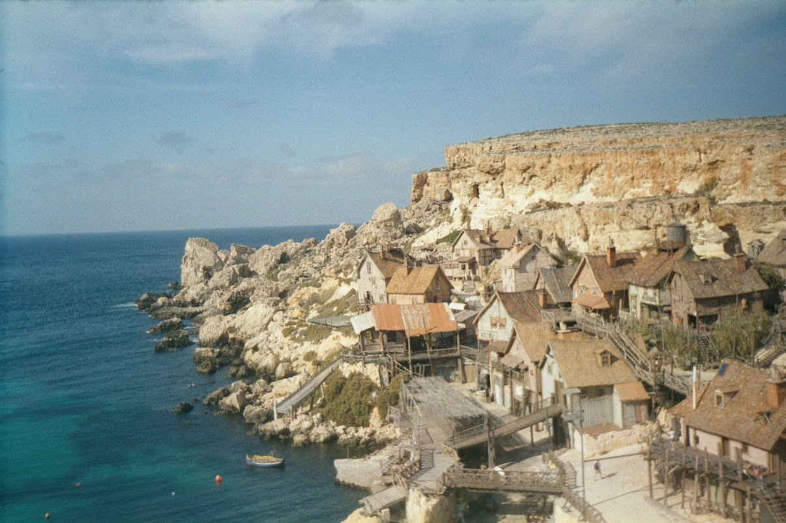
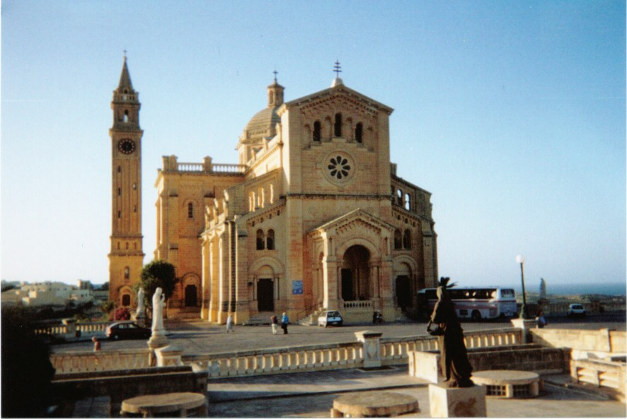

A photo from back in November 2000, the first big holiday Lisa and I ever took. We stayed near St Julian's in Malta and one day took this brilliant cruise around the bay, which was just so relaxing. 
<!--more-->

Back then, we didn't have a car, so we walked everywhere around the place, took bus tours and little cruises like this one. There were no prams to push, no deadlines to meet and we simply explored the island at our leisure. There's something irresistable about the architecture of those buildings, the little first floor balconies and the ornate arches and distant domed roofs. November's a funny time to go for a holiday as well. Well, it was back then. We were the youngest couple travelling amongst a group of silver surfers and blue rinses from the UK mainland: part of the group was massive good fun, and part were such a curmudgeonly bunch, you wonder why they bothered to leave home in the first place. Probably because they'd run out of things to grump about...

Here's a photo I took during our holiday in Malta in 2000. It's the abandoned set from the Popeye movie featuring Robin Williams. Normally, a movie production would be expected to restore an area to its original condition, but I suppose on this occassion the Maltese folk thought it might be handy to keep it as a tourist attraction. Of course, Malta's had a few more movies, Ridley Scott's Gladiator for one, but also a few James Bond movies as well. I think Troy may have been filmed there too.

 

## Our Lady of Ta Pinu, Gozo

The shrine of Our Lady of Ta' Pinu is located on the island of Gozo, a short ferry journey from Malta. It is located just outside the village of Gharb. We traveled there by coach in the autumn of 2000. The inside of the basillica is extremely quiet and serene, and visitors are asked to cover up exposed flesh while inside - I think Lisa was provided with a wrap to cover her legs on the day (she was wearing shorts). It was quite nice to see the observation of old traditions back then, something which came across a lot during our visit to Malta.

 

### What does the name mean?

Ta' Pinu means "Of Philip", referring to the benefactor who donated money for the restoration of the church in 1611. As a mark of his generosity, the name was changed from "Of The Gentile" to "Ta' Pinu".

### History of Ta' Pinu

A church has existed on the site for centuries, although an early mention in 1575 noted that the church was in terrible condition and it was ordered to be demolished and services moved to the Cathedral of Gozo. However, according to legend the demolition was abandoned when the first workman to strike a blow to demolish the church broke his arm. This was taken as a bad omen and the church was retained, although it was later restored by Pinu Gauchi. The church you will see at Ta' Pinu today had its beginnings apparently [by heavenly intercession](http://tapinu.org/index.php?lang=en):

> On the 22nd June 1883, Karmela Grima a forty-five year-old spinster and great devotee of the Blessed Virgin, heard a call, while passing by the chapel on her return home from the fields which surrounded the chapel. "Come, come", she heard a woman's voice say. She was confused and frightened, and began to run away from the place. The voice called again, and this time Karmela realised that the voice was coming from within the chapel, she went inside and said her usual prayers. The voice which had come from the image of the Blessed Virgin asked her to recite three Ave Maria in honour of the three days Her body remained in the tomb before Assumption to Heaven.

Following this event, Ta' Pinu became a place of pilgramage and attracted the attention of the Catholic church. When Bishop Pietru Pace confirmed the voices of heavenly origin, the number of pilgramages to the church exploded. As a result, work on the impressive building that stands there today was begun. The construction effort commenced in 1920 and culminated with the blessing of the new church in 1935. A statue of Karmela stands outside the church, marking her story. For more information about Ta' Pinu, check out this history, or the [official website](http://tapinu.org).