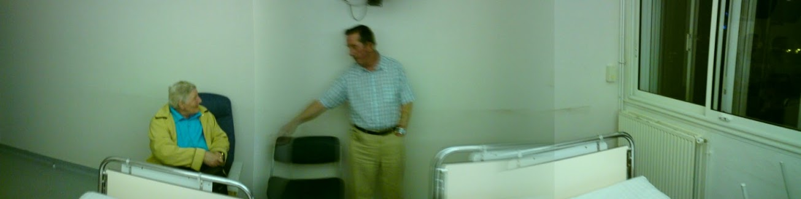

Last Wednesday I got dragged to France. I've never been to France, although I have tried their method of kissing before and even their ticklers once or twice.
<!--more-->

Lisa and I had taken the kids to London for Easter weekend, their first visit to the city. That visit is another story entirely - hint: try dragging a 3 year old around London for a weekend with the Circle and District lines under repair. We returned home on Monday evening, went straight to bed. Upon waking the next day, the first thing to happen was a phone call to say that my father was in hospital...in LOURDES! 

Information flowed quickly from there - he'd taken some kind of attack, been rushed to hospital, given tests (including an MRI) at which point word filtered out that he had "a 90% mass" in one of his lungs. A cousin delivered this news to me personally (which was appreciated, but unnecessary), although we'd already decided that I should fly out the next day. 

Lisa - Our Lady of Internet Deals - made the booking and drove me to Dublin for my flight to France. My one-way flight to France. I didn't quite know when I was coming back.

Wednesday: Flying to Lourdes
----------------------------

All I'll say is that Dublin airport is a weird and wonderful place - automated check-in of your own bags and a departure lounge that has about as many seats for the number of weary travellers as the Titanic had lifeboat seats for its passengers. 

The fact that I barely speak French really only hit me when I landed. We've been drilled with the knowledge that the French don't like it when you speak English to them. Fortunately, the tsking of irate French officials isn't fatal, and anyway, the people I encountered were actually quite helpful. 

I took a coach to Gare Matabiau in Toulouse and queued up for my train ticket while a convulsing man was removed from ahead of me by ambulance staff. An earlier train delay worked in my favour as the train for Pau arrived shortly after I'd bought my ticket. I hopped aboard and was treated to the most beautiful and unexpected view of the Pyrenées as the train moved toward Lourdes. Thunderous clouds eventually gave way to a brief burst of hailstones, finally morphing into blue skies for my arrival in Lourdes. 

Now, I don't often wear my Athiest credentials on my sleeve, but Lourdes was the last place on Earth I ever expected to find myself. I was actually quite annoyed at being there, and was tempted by the possibility of a train ride to Carcassonne (I'm a big fan of Kate Mosse's novels). 

I was met at the station by the priest who was accompanying my parents on the trip, and he gave me a quick and grave assessment of my father's situation before taking me off to the hospital. A quick visit to the old man revealed that he was in decent spirits - naturally, since neither he or my mother had actually been told about the diagnosis. 

The true horror came later, when we arrived at their hotel (Hotel Paradis) and I discovered that I'd have to share a bed with my mother. Thankfully, the hotel rectified this the very next day by moving us to a twin room!

 

Thursday: A second diagnosis
----------------------------

A brief discussion with the (very pretty) young doctor who'd been treating my father revealed a second problem: as well as the 'large mass' in his lungs, there was an apparent tumor growing _around_ a valve in his heart. Speaking through the priest (not in the style of The Exorcist, although that would have been cool), and a smattering of broken English, she reiterated the seriousness of the situation and said that it would be important to get him straight into hospital when he arrived back in Northern Ireland. 

A further horror happened that morning. I got dragged along to a mass for the sick. _This_ I did not sign up for. My mother, conveniently side-stepping my Athiesm, innocently enquired as to whether I'd be taking Communion. 

For some reason, I can tolerate Christianity when I'm away from its antiquated rituals, but as the ceremony progressed, I found my blood was boiling. It was as if Satan was writhing within me. Except Athiests don't believe in Satan either - gotcha! But seriously, the outdated call and response and the never-changing chants brought back how mind-numbingly dull religion can be. 

I should clarify the plus side though - before the lynch mob show up at my front door - there was an impressive sense of community within the group, and there was a lot of concern among them for my father and what had happened to him. Plus, the maurauding gangs of youngsters wandering the streets of Lourdes were clearly having some childhood defining moments. It wasn't all about religion, but religion may have been the enabler. We'll look at that someday when I write about my approach to Athiesm and militant Athiesm in particular.

Friday: How are we getting home exactly?
----------------------------------------

Friday was to be the second last day in Lourdes, and our attention turned to how we were getting home. After being told that we needed to go straight to the hospital upon arrival in Belfast, we wanted to know how that would happen. Surely the insurance or the hospital should be arranging an ambulance to pick him up from the airport? 

You might think that, but you'd be wrong. The hospital were happy to discharge him for his flight home, but we were told to talk to the insurance people. We did this through the holiday rep, but she said the insurance company weren't interested. I got the impression that both she and the insurance were just interested in getting us home and didn't give a toss what medical attention my father got when he got home. The best they could suggest was that we make a 999 call ourselves when we returned. 

A final consult with a senior doctor seemed to go well enough, but when we returned to the hospital ward, my father revealed that the _other_ doctor had spoken to him and said that he also appeared to have two - not one, but two - aneurysms. She seemed to think this was serious enough, although she stressed that from the size of them, they'd clearly been growing for quite some time. 

We tried to see if this would sway matters with the insurance people, but apparently not. Two significant tumors and two aneurysms are apparently not enough to make some idiot at an insurance company lift a phone and organise an ambulance to meet you off your return flight.

Saturday: Coming home
---------------------

Saturday morning was actually quite relaxed. After packing up our bags and stowing them with the tour organisers (who were extremely helpful throughout the whole week), I took my mother out for a little walk to break up the day. 

We stopped off from a coffee, and browsed some of the little souvenir shops along the streets. An interesting state of affairs: they stock holy water bottles and statuettes alongside a variety of blades and knives. Things verge into the utterly tacky with porcelain dolls of nuns and a ceramic head of Christ dripping with blood. 

And then she treated me to a tour of the Musee de Bernadette - a series of waxwork scenes depicting the life of Bernadette. 

Hilariously, by the time we'd explored the ground level, they'd run out of scenes, so the next three floors featured...the life of Jesus! The saving grace was quite a good panoramic view over Lourdes. 

It needs to be mentioned though - according to the priest there are _only 67 confirmed 'miracles'_ to have taken place in Lourdes. Out of all the sick and faithful who visit that place - thousands? millions? - only 67 people have ever experienced a cure in visiting Lourdes. I wonder how that translates into an actual success rate? 

Back to the hospital, and we'd officially been abandoned by the tour rep and had to communicate with the non-English speaking staff through a series of comedy gestures and whatever. Eventually we got him discharged - and had to trail him out to the taxi as he spent too long saying his goodbyes to the nursing staff! 

We taxied out to the airport, giving the old man his first proper glimpse of the Pyrenées since arriving. At the airport, he received a warm welcome from the group he'd travelled with, and we eventually flew home after an hour-long delay. 

On the other side, I had a word with an airport attendant who helpfully called for an ambulance for us. It met us in good time at the front door of Belfast International and we hastily told the medics about his condition and the recommendations of the doctors at Lourdes General. They were immediately aghast: "No-one should ever fly with an aneurysm - this man should have travelled by boat." 

But at the end of the day, we finally got him admitted to hospital. That was the main goal for us, because we \*didn't\* want to have him return home after receiving such a shocking diagnosis and go back to his GP. He was clearly worried by the results of his tests, and sending him back to square one in the medical system just wasn't an option. 

Anyway, he spent a few days in hospital over here, but Antrim Area didn't seem to feel that his condition was as urgent as the doctors in France. He'll return to hospital next week in order to have the tissue in his lungs biopsied, and no doubt things will progress from there. 

Thus endeth the adventure in Lourdes. I've got a few pictures to share - not great qualty unfortunately, from my mobile phone - which I'll shortly post to the photoblog here.