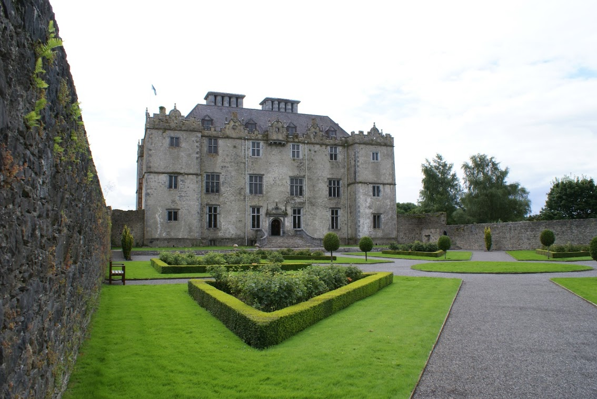
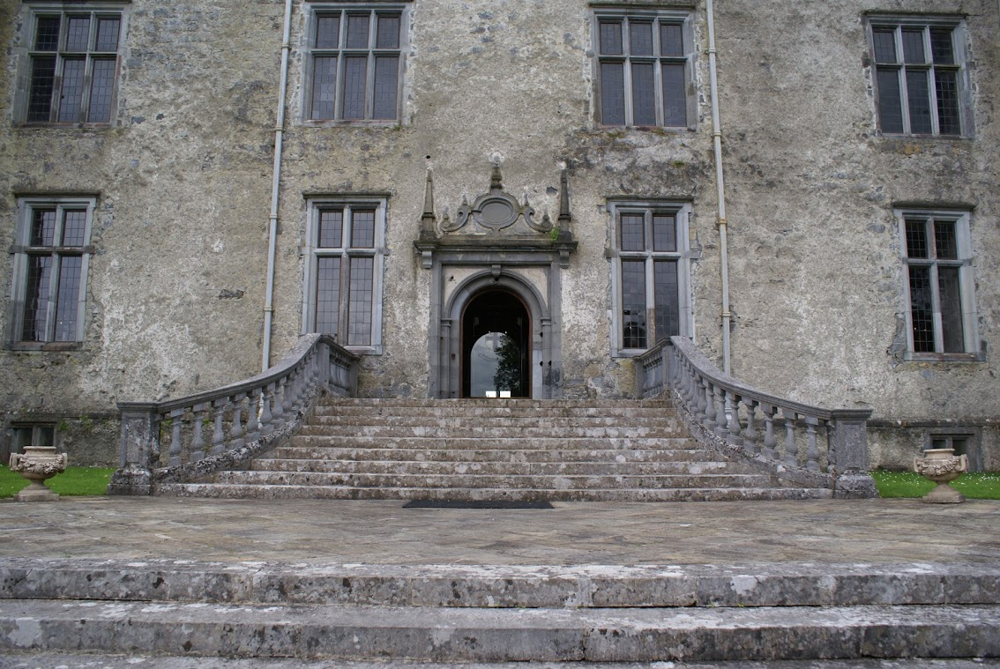

The boys and I have just come back from a short trip to Galway. On the second day we stopped off at **Portumna**, a quiet little town that Lisa and I discovered on a Shannon cruise about 9 years previously.
<!--more--> 

Portumna Castle was built around 1618 by the de Burgo family and provided quite nice lodgings for them until in burned to the ground some 200 years later. No word as to whether the fire of 1826 was started accidentally or otherwise, but it left the house devastated and roofless. 

Something that's rarely mentioned is that a new castle was commissioned and built. Funny that the replacement castle _also_ burned down and was [completely removed](http://www.portumna.net/home/history.html) \- "the stone from the ruin was used to build the Catholic Church in the town square in 1958." 

Anyway, I was keen to see how the efforts to reconstruct the castle had come along since Lisa and I wandered into Portumna almost a decade ago. I'm not sure how the restoration project is funded, but it hadn't changed much. 

 

Only the ground floor of the castle is accessible to visitors. However, the area to the back of the castle now houses a DVD showing the damge to the property and a little bit of how the restoration was carried out. It also has a number of portraits of the former inhabitants of Portumna Castle, members of the de Burgo (Burke) family. 

A small thing that really brings the castle to life is the skeleton of a dog called "Fury" who lived there. Fury met his untimely end when one of the young ladies of the castle fell from a window and the dog unwittingly broke her fall. Sadly this also broke his back and killed him. Fury was buried on the premises with a plaque to tell future generations how valued he was by the family.

Entrance to Portumna Castle
---------------------------

 

A front-facing shot of **Portumna Castle**. From the informational DVD on display at the castle, the outer walls of the castle would have been painted white and the cornerstones painted a dark, possibly black colour. 

Although the entire downstairs is now completely open-plan thanks to changes made by a devastating fire in 1826, it once would have been panelled all the way down, creating a hallway with two large rooms to either side. A staircase at the bottom of the entrance hall would have led to the upper floors. 

I love the elegant steps leading up to the front doors of the castle, and the view of the formal garden from the doorway is beautiful.