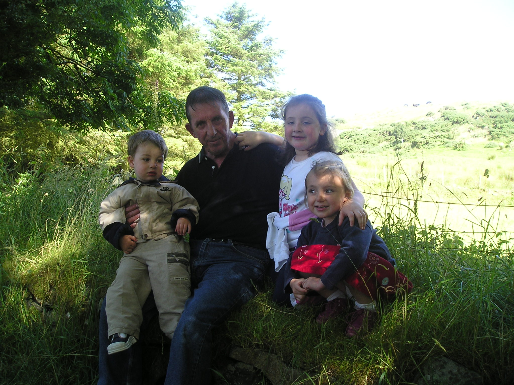

Rewind to two days before the funeral, his green Nissan Primera racing toward Ballycastle for the final time. But he’s not at the wheel, _I’m_ the driver, my newly widowed mother beside me, still shell-shocked. Sister in the back seat, silent. 
<!--more-->

The motorway was crowded with delivery vans and people with places to be. We suddenly had a funeral to prepare for, and drove along in a bubble of silent devastation. Slightly envious of those people who had a _normal_ day ahead of them. 

I mention this, because the days leading up to my father’s funeral went by in a blur of relatives and blasts-from-the-past, and chain-drinking cups of tea. The beauty of a wake is that you don’t get a minute to dwell on your loss. That comes later. And although you wouldn’t think it, the constant stream of visitors was a massive comfort. Those faces from my childhood that I hadn’t seen in years, all with their own different connections to _him_. It was amazing to watch the enormous extended family rallying around, taking care of virtually everything and providing an endless supply of egg and onion sandwiches. 

And then fast forward to the day of the funeral. The house hadn’t actually went to sleep, my mother, Aunt Mary and Uncle Joe having stayed up all night. I finished dressing down in the front room where the coffin was, breathing in that pine smell that will forever be associated with the funeral. How absurd it was to watch him in that box. There was no denying the reality of it though, as little patches of discoloration were starting to spread on his hands and the side of his neck. 

That’s the strange thing about seeing your father in a coffin - it’s not really him, is it? The skin was too pale and the hair _not quite_ how he used to style it. There’s a curious detachment because the body is no longer where he exists. Everything the man was is now just a series of memories, carried on by the people who knew him. And as I sat there pulling on my shoes, all I wanted was one last conversation. To engage in the friendly mockery or a little horseplay like we used to do. 

Soon enough, the house filled up again with relatives and neighbours. The kettle was on a steady rotation. Lisa couldn’t get used to the fact that the front blinds were closed and kept opening them, then remembering and closing them again. 

The funeral director arrived, and suddenly things swung into action. We arranged for the all-important first lift of the coffin, making sure most of my father’s family were represented in some way and myself and my brother-in-law Michael. The various mass cards surrounding the coffin were swiftly taken away and visitors shooed out of the room while the coffin lid was fitted on.

The Procession
--------------

A few moments later, six of us were outside the house having the coffin placed on our shoulders. The exact details are hazy, but I think Chris and Pat took the foot of the coffin, Joe and Michael McGarry the middle and Michael Boyle and I at the head. I remember clearly the edges of the coffin biting into my shoulder as Michael and I reached for each other’s shoulders - standard funeral formation, apparently. Michael gave me a reassuring pat on the shoulder as we started to shuffle along the road behind the hearse. My father wasn’t a tall guy, six coffin-bearers suddenly seemed excessive, so after quick consultation with the funeral director, we switched to four per ‘lift’. 

If you take a few moments to think about it, walking through the streets of your hometown with your father’s body in an extravagant wooden box is an absurd notion. Especially when you’re following a car designed to _carry_ a coffin. But as his brothers, nephews, neighbours and all the other men folk who’d known him stepped forward to do a ‘lift’, it was easy to see the dignity, the nobility, in the tradition. I remember seeing our neighbours, Sean and Martin, pushing their way to the front, almost insistent that they get their turn. 

The procession headed toward the church, with myself, Michael and various uncles and cousins at the front. As we passed his local supermarket - The Spar, where he’d shopped for years - the management lowered the shop’s white shutters, a gesture which was really touching as we passed. A small band of locked-out customers stopped to watch as the procession passed by. 

At one point, I remember looking back for my mother and sisters. Where were they? I’d completely forgotten that Rosie wouldn’t be able to join the procession because of her arthritis, and Patricia was heavily pregnant at the time, so she’d have had to go by car as well. Just Michael and I then. It’s worth mentioning that as married-in members of the family, I didn’t expect Michael and Lisa (my wife) to be so deeply affected by his death. However, Chib’s respect was hard-won, and in recent years he was so chatty with Lisa that we both suspected he liked her more than me toward the end! Both were totally devastated, Lisa especially hard-hit since a well-loved aunt had been cremated just the week before. 

Finally, the rotation of coffin-bearers exhausted, we wrestled the coffin into the hearse and then followed the remainder of the way to the church. The anguished, carved pine face of Christ stared out at me from behind the window of the hearse. You’d know when you were too close to the hearse when your reflection perfectly covered that carved pine face.

The Service
-----------

The hearse pulled up outside the church and our original six reformed to carry the coffin inside. While the mother and sisters sat on the left hand side, our coffin-bearing posse was pointed to the right hand side to keep us close. I must say, Peter the funeral director was invaluable throughout the mass at reminding the lapsed-Catholics and Atheists among us when we should sit, stand or kneel. 

A tap on my back revealed that my daughter Rachel had arrived and was sitting behind me. The kids had been minded by Lisa’s sister for the couple of days we went ahead for the wake, so we were glad to see them and Rachel spent most of the service stroking little patterns on my back. 

Reminiscing on the funeral service itself, there’s not much to tell. Having come from Lisa aunt’s funeral the week before, I lamented the cookie-cutter nature of a funeral service. There was a funny moment during the readings, that bit about walking through ‘the valley of death’, where I giggled inwardly at the similarity with Coolio’s _[Gangsta’s Paradise](http://www.youtube.com/watch?v=WxF-ImXaUdE)_. I looked over at Lisa, who knew _exactly_ what was going through my mind and smiled over. 

Possibly the worst bit was when the priest botched his eulogy. I’d spent some time the earlier evening talking about my father and explaining some of my strongest memories of him. I’d told him about how we used to clean chimneys when I was a teenager and how that was an awesome bonding experience, and that it showed the lengths he went to in order to ensure the family was provided for. I mentioned that he never hurried and seemed to realise that especially the pensioners we did the odd job for appreciated the company, so he’d make time to chat to them. 

How did this translate in church? “James moved quietly through people’s homes…” OK, I think he finished that sentence with “helping them” in some way. But for a moment, the official eulogy for my father implied that he was a professional cat burglar or something. 

Anyway, the service ended after a while. I’d spent a vast amount of it mentally x-raying the coffin, picturing him inside. Knowing that none of the words uttered inside the church would conjure him back to life, and that there’s very little comfort in a service that’s read from a script. The coffin was hoisted back onto our shoulders for a short walk round to the graveyard. That now-familiar sharpness of the coffin corner cutting into my shoulder for the last time.

The Graveyard
-------------

And finally we arrived at the graveside. I remember when it was just a vacant grassy strip behind the church. As a teenager, groups of kids, uninspired by dull sermons and unaccompanied by parents, we’d escape round the graveyard and hide out in the girls primary school shelter behind the wall. So, unknowingly, I walked over my father’s future grave quite a few times in my youth. Who knew? 

We brought the coffin to the graveside and set it down on two thick planks of wood that bridged the hole. Instead of using a winch mechanism, we were to do it the old-fashioned way, lowering the coffin into the grave with straps. Ah, how those straps burned the hands as we eased the coffin down. And the lower it went, the clearer the depth became. To look inside for too long caused dizziness - the sides of the grave were so smoothly cut - and then the wooden box came to a rest at the bottom. Someone threw in a handful of earth that scattered across the surface of the box, slightly obscuring the brass nameplate. 

Of course, it was the priest. I’m sure more words were uttered, but I barely heard them. The dreaded moment had arrived, the traditional part of a funeral where the family line up and the congregation walk along, shaking hands and offering condolences. It’s a bizarrely mechanical process, person clasps your hand and says “Sorry for your loss.” You mutter something to complete the ritual and the line continues to move along. It was all going well until Sean, the neighbour, came along. 

Something about Sean reminds me of my father - not exactly cut from the same mould, but there’s a kind of resonance there for sure. At that point, all the pragmatism melted away and a fist-sized lump started rising in my throat. Sean and his son moved along, and I was glad to see Imelda, the mother of a good friend coming toward me. I’d had a long chat with Imelda the day before when registering the death, and something about her allowed the grief to come pouring out. I mean, I really bawled, head buried in her shoulder, stunned at the emotions and feeling surprisingly helpless. 

Out of the corner of my eye, I could see the kids playing around one of the trees in the graveyard. Ah, memories of doing _exactly the same thing_ came to mind, running giggling oblivious to the somber events taking place nearby. Maybe it seems strange, but like that day driving back to Ballycastle to prepare for the funeral, it was nice to know that someone was having a normal day. It was a reminder that life would eventually return to normal. 

That night, the family congregated in the house over a few bottles of wine. We dragged out some old photo albums, mocked the 70’s haircuts and the terrible clothes we wore in the 80’s. We had a few drinks to our fallen father who was no longer suffering from lung cancer. 

