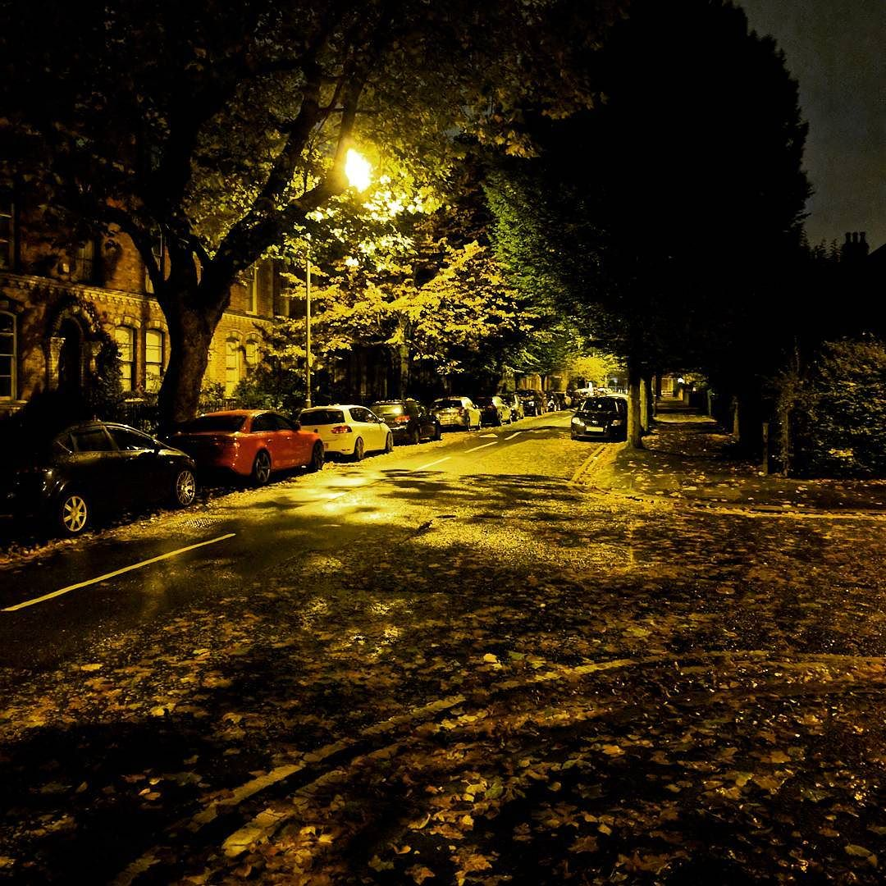
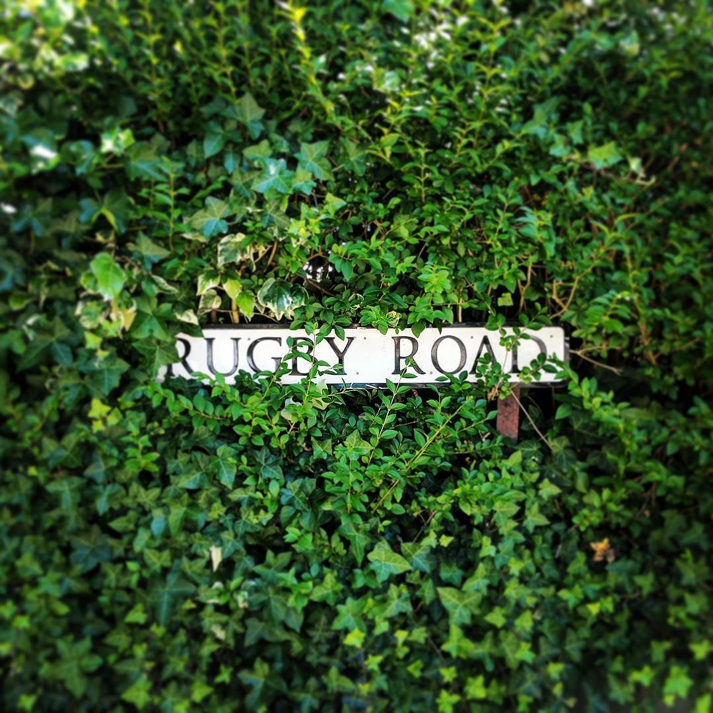
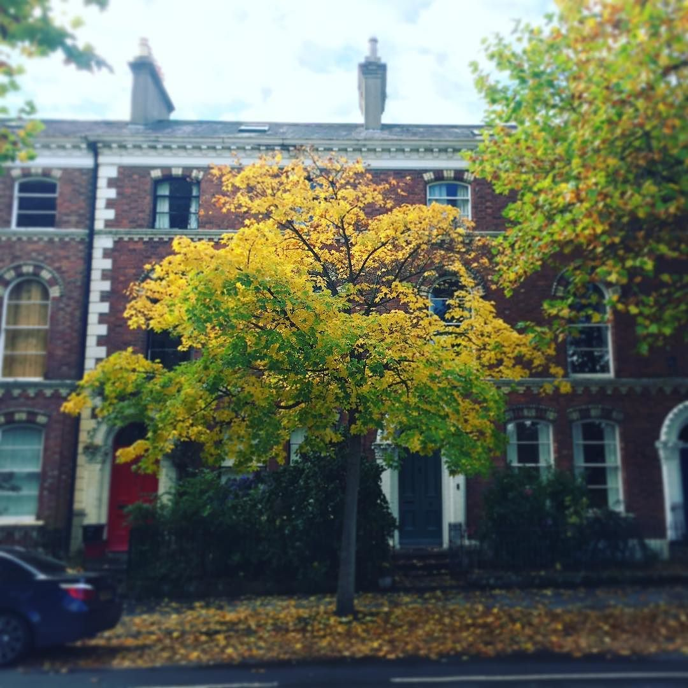

Hey there, reader. Let me tell you a story about a leafy, bumpy road in South Belfast that I've come to call home.
<!--more-->

When I moved to Rugby Road in June 2016, it was just two months shy of my 40th birthday. A milestone birthday, and yet it was eclipsed by possibly the most turbulent period of my life. A 20-year relationship had ended and I had chosen to return to the Queens area where I'd first landed in the 90s. 

It's absolutely staggering to think I moved here less than two years ago. Memory won't do justice to the chaos that was brewing at the time - moving out of the family home, striking out on a new career, fending for myself but needing to maintain a relationship with my children and trying to navigate tempestuous new relationships. 

On the face of it, the wisecracking continued and only a handful of people knew about the anxiety and actual terrifying palpitations that had crept up on me. And yet at the same time, there was a current of optimism running alongside it: that everything would be alright, and I had a chance to reshape my life, establish what I wanted and go for it. 

Rugby Road was a huge part of that. It helped me reset. I needed to find stability and grow from there. The move to Rugby Road brought me back to my university stomping ground. That optimistic, naive, long-haired blow-in from Ballycastle, thinking that just about anything could be achieved with the right attitude. Where had that guy gone?  I genuinely believe moving back here helped me tap back into his spirit. 

 That _one time_ I went to the gym in the wee small hours...

The last two(ish) years have been filled with playfulness, laughter, friendship and romance. The joy of discovering new people: from the folks at Belfast Running Club to the yoga types in Flow and other new friends along the way. I've tipsily sauntered up that road in the small hours, munching on a curry chip and grinning inwardly (and sometimes outwardly) at the drunken decadence that's usually going on around Queens at night.   

Sure, there's been a little heartbreak and a touch of regret along the way. I won't dwell on that, but it certainly feels like I've lived more in the last two years than the ten before that.

Moving on...
------------

So why is it goodbye? A delightful convergence of events, actually. I decided at the start of 2018 that I was going to buy a house this year. And as luck would have it, my old house agreed for sale the same week I was told my lease on Rugby Road would end in March. 

A couple of weeks ago, I agreed to buy a new house. In true Goldilocks and the Three Bears fashion, it's not too big and not too small. And it's in just the right area for me. And it's not too far away from Queens. 

As much as I'd envisaged moving house _sometime_ this year, I didn't picture it happening so soon. All my other plans have been shoved to one side and suddenly I'm trying to understand mortgages, bidding on properties and bizarrely thinking of this new place as _home_ already. Oh yeah, and trying to make a conveyance happen in a **scandalously** short period of time - I love the idea of making the impossible happen! 

Still, I'll miss this little two-bed apartment. I've come to love the leafy avenues round here, the regular dander down to Clements and being within walking distance of _everywhere_. There are already little pangs of sadness knowing that each time I drive out the gates is closer to the last time. 

The thing about this move though is that it was always about change. It was only ever meant to be a temporary stop along the way to something else. Now it's time to move along and set up a home. 

But, for want of a better cliche, Rugby Road is where I rediscovered myself. 

